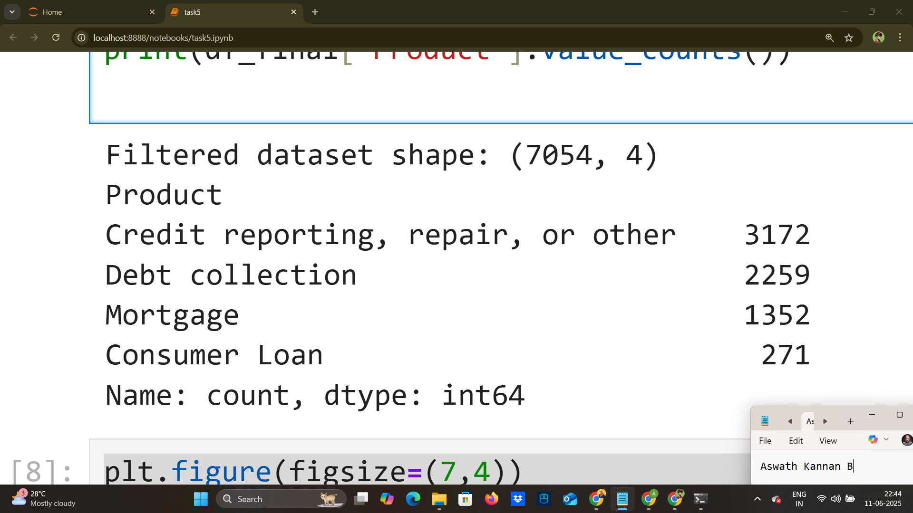
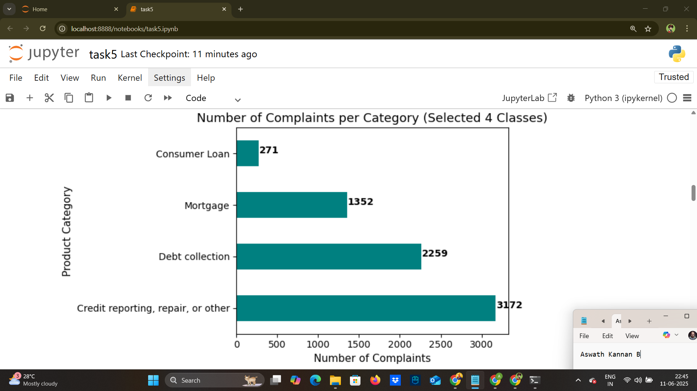
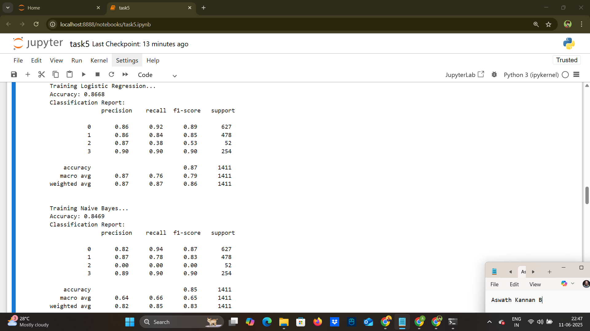
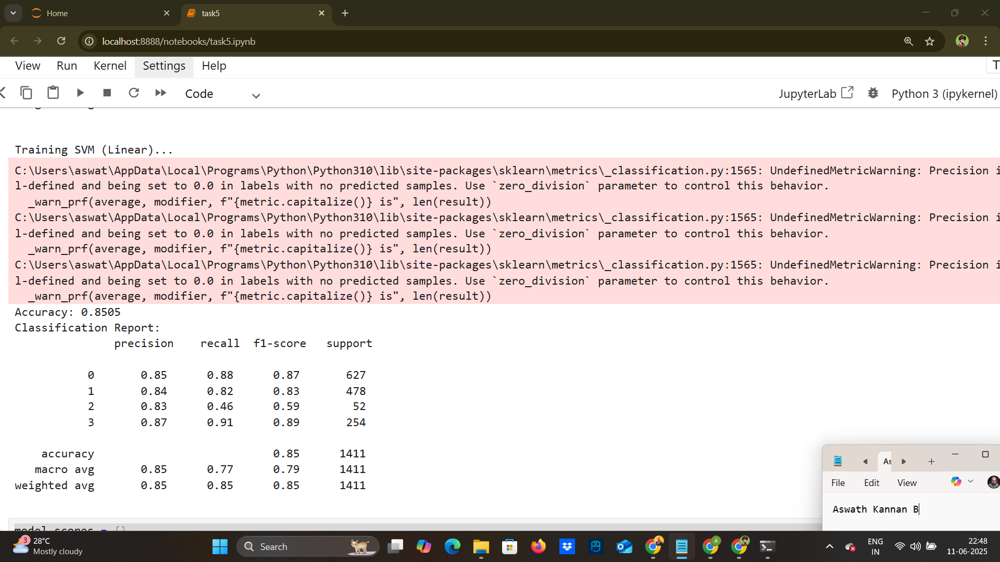
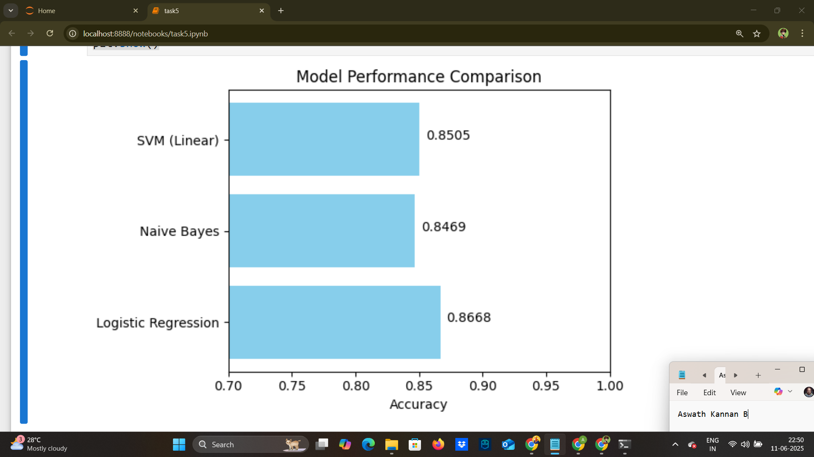
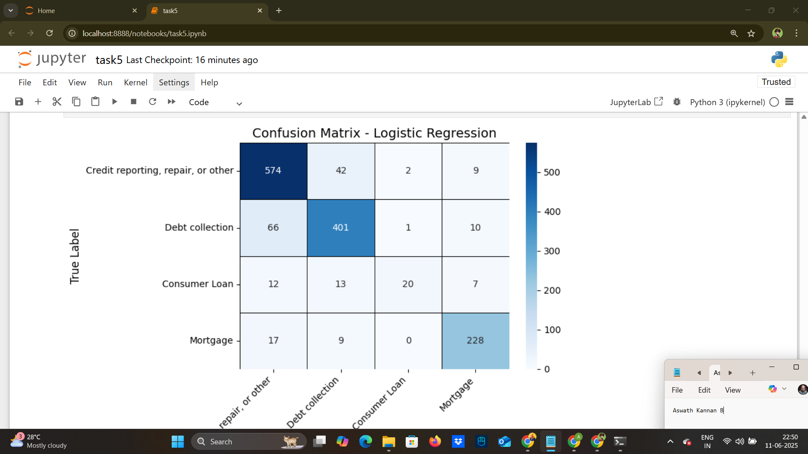
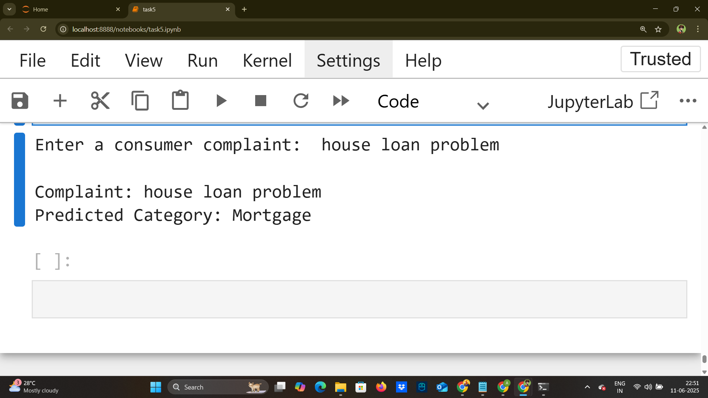

# Task 5. Data Science example

## Objective
This project performs **text classification** on the [Consumer Complaint Database](https://catalog.data.gov/dataset/consumer-complaint-database) to categorize complaints into the following classes:
- **0**: Credit reporting, repair, or other
- **1**: Debt collection
- **2**: Consumer Loan
- **3**: Mortgage

---

## Steps Followed
1. Explanatory Data Analysis (EDA) and Feature Engineering
2. Text Preprocessing (cleaning, tokenization, lemmatization)
3. Model Selection: Logistic Regression, Naive Bayes, SVM (Linear)
4. Model Performance Comparison
5. Model Evaluation using Accuracy and Confusion Matrix
6. Real-time Prediction using user input

---
## How to Run
1. Clone this repository.
2. Place the `consumer_complains.csv` file.
3. Run the code:
```bash
python src/complaint_classification.py
```
4.Enter a consumer complaint when prompted to see the predicted category.
---

## Screenshots with Code

### 1. Filtered Categories and Dataset Shape
- code:
```bash
target_categories = {
    'Credit reporting, repair, or other': 0,
    'Debt collection': 1,
    'Consumer Loan': 2,
    'Mortgage': 3
}

df_final = df2[df2['Product'].isin(target_categories.keys())].copy()
df_final['label'] = df_final['Product'].map(target_categories)

print("Filtered dataset shape:", df_final.shape)
print(df_final['Product'].value_counts())

```
- Screenshot Example:
  

### 2.EDA - Bar Plot of Complaint Categories
- code:
```bash
plt.figure(figsize=(7,4))
class_counts = df_final['Product'].value_counts()
class_counts.plot(kind='barh', color='teal')

plt.title('Number of Complaints per Category (Selected 4 Classes)', fontsize=13)
plt.xlabel('Number of Complaints', fontsize=11)
plt.ylabel('Product Category', fontsize=11)
plt.xticks(fontsize=10)
plt.yticks(fontsize=10)
for i, v in enumerate(class_counts):
    plt.text(v + 10, i, str(v), color='black', fontweight='bold')
plt.tight_layout()
plt.show()
```
- Screenshot Example:
  

### 3. Model Training and Accuracy
- code:
```bash
models = {
    'Logistic Regression': LogisticRegression(max_iter=1000),
    'Naive Bayes': MultinomialNB(),
    'SVM (Linear)': LinearSVC()
}

for name, model in models.items():
    print(f"\nTraining {name}...")
    model.fit(X_train, y_train)
    preds = model.predict(X_test)
    acc = accuracy_score(y_test, preds)
    print(f"Accuracy: {acc:.4f}")
    print("Classification Report:\n", classification_report(y_test, preds))

```
- Screenshot Example:
  
  

### 4. Model Performance Comparison Plot
- code:
```bash
plt.figure(figsize=(6,4))
plt.barh(list(model_scores.keys()), list(model_scores.values()), color='skyblue')
plt.xlabel("Accuracy")
plt.title("Model Performance Comparison")
plt.xlim(0.7, 1.0)
for index, value in enumerate(model_scores.values()):
    plt.text(value + 0.005, index, f"{value:.4f}")
plt.tight_layout()
plt.show()
```
- Screenshot Example:
  

### 5. Confusion Matrix Heatmap
- code:
```bash
plt.figure(figsize=(8,6))
sns.heatmap(cm, annot=True, fmt='d', cmap='Blues', 
            xticklabels=labels, yticklabels=labels,
            cbar=True, linewidths=0.5, linecolor='black')

plt.title("Confusion Matrix - Logistic Regression", fontsize=14)
plt.xlabel("Predicted Label", fontsize=12)
plt.ylabel("True Label", fontsize=12)
plt.xticks(rotation=45, ha='right', fontsize=10)
plt.yticks(rotation=0, fontsize=10)
plt.tight_layout()
plt.show()

```
- Screenshot Example:
  

### 6. Real-Time Prediction
- code:
```bash
user_input = input("Enter a consumer complaint: ")
predicted = predict_complaint(user_input)

print("\nComplaint:", user_input)
print("Predicted Category:", predicted)

```
- Screenshot Example:
  

---
## Author

### Name: Aswath Kannan B


